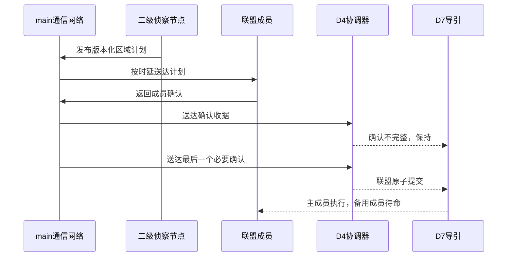

# D4 因果通信与三成员联盟验证

## 结论

本轮关闭了 D4 联盟确认链路的运行级阻塞。联盟提案不再因网络确认尚未到达而立即终结。
计划广播、成员确认和二级节点就绪均经过统一通信队列。D4 只依据实际送达的收据形成授权。

2 目标、4 资源的三维质点回归中，一个高威胁目标分配 2 架主拦截机和 1 架备用机。中心
失效后二级计划在 `2.0 s` 发布。`2.05 s` 时确认数为 0/3，所有成员保持；`2.10 s` 时确认
数为 3/3，联盟原子提交。两架主机随后进入三维中段比例导引，备用机继续待命。

## 信息链路

通信收据绑定发送节点、接收节点、计划编号、计划版本、故障代次、租约、分区代次、消息编号
和载荷摘要。任何字段不一致均不进入联盟确认集合。无效或过时确认被拒绝，但不会让单条异常
消息永久终结一个仍可完成的联盟。摘要冲突、网络分区、租约到期、成员不可执行和显式终结
会结束当前代次。

## 场景

| 项目 | 设置 |
| --- | --- |
| 目标数 | 2 |
| 拦截资源数 | 4 |
| 二级侦察节点数 | 1 |
| 高威胁需求 | 2 架主机 + 1 架备用机 |
| 中心失效时刻 | 1.5 s |
| 单程通信时延 | 40 ms |
| 通信抖动 | 0 |
| 丢包率 | 0 |
| 仿真时长 | 3.2 s |
| 随机种子 | 1271 |

该设置用于验证因果时序和版本合同，不代表通信设备性能指标，也不代表 200 对 200 场景已经
达到实时运行。

## 结果

| 时刻 | 计划状态 | 确认状态 | D7 行为 |
| ---: | --- | --- | --- |
| 2.00 s | 二级计划版本 2 发布 | 尚未形成新版本确认 | 保持 |
| 2.05 s | 版本 2 有效 | 0/3，`collecting_acks` | 两架主机保持，备用机待命 |
| 2.10 s | 版本 2 有效 | 3/3，`committed` | 两架主机进入中段比例导引 |
| 3.00 s | 区域计划版本 3 形成 | 旧确认不直接沿用 | 重新等待新版本收据 |
| 3.10 s | 版本 3 有效 | 3/3，`committed` | 主机恢复执行，备用机待命 |

本例共送达 56 条 D4 控制消息，其中联盟确认 12 条、区域计划广播 16 条、二级就绪消息
28 条。56 条均通过收据校验，拒绝数为 0。在线真值使用为 0，D7
`global_track_id` 改写为 0。

## 修正

D4 owner 将提案、部分确认和完整确认分开处理。提案和部分确认在租约内保持
`collecting_acks`。完整确认后一次性进入 `committed`。这项修改不改变 D3 的计划版本、
D5 的身份约束或 D7 的比例导引公式。

main 修正了区域授权租约。一个区域内可能同时存在三成员任务和单成员任务。区域授权采用
最短有效租约后，每条任务提交证据也同步收紧到该租约，避免下一周期出现
`regional_coalition_lease_exceeds_authority`。

保留种子干预选择器现在跳过故障代次栅栏。它只选择已经完成 D4 裁决、且 D3 已采用相应
所有权的帧。连续中心和二级失效场景的测试窗口由 3.2 秒延长到 4.2 秒，用于覆盖计划广播
和确认往返。

## 验证

- D4 模块：`569 passed`；
- scalable 模块栈：`66 passed, 1 warning`；
- scalable 全量：`272 passed, 1 warning`；
- `git diff --check`：通过。

warning 来自本机 Matplotlib 三维投影组件版本冲突，不影响本轮状态机、JSON 证据和控制
命令。

## 剩余工作

D6 正式矩阵包含 5700 个单元。当前静态准入结果为 expected=`5700`、accepted=`0`、
verdict=`fail_closed`。正式运行 manifest、逐单元结果、置信区间、曲线、动画和正式准入
模型尚未形成。下一步应在 clean detached worktree 先运行 R0 分批基线，再按模型准入状态
决定其他变体是否进入正式矩阵。
