# 二十目标长距离视觉配准工作报告

## 结论

二十目标长距离配准已经完成从理想几何、窄视场扫描到真实 AirSim ComputerVision 运行的
分阶段验证。当前主场景包含 20 个以 50 米/秒运动的无人机网格目标。中心相机距目标约
2.8 至 3.2 千米，拦截相机距目标约 500 米。中心侧持有三维全局航迹，拦截侧只产生匿名
像素检测和局部轨迹。两级配准均使用相机内外参、双时间戳、协方差、几何门控和匈牙利
一对一匹配，不读取 AirSim 目标名称和对象编号，也不改写全局航迹编号。

理想质点场景的两级关系链已跑通。10 个种子中，20 个目标的两级匹配准确率、完整关系链
比例和可见率均为 100%，身份切换为 0。该结果证明了几何关系和算法顺序正确，不包含设备
误差和检测失败。

真实 AirSim 主场景的最新已完成基线为单种子 `20260810`。中心发现并连续确认 20/20 个
目标，拦截相机完成 19/20 个提示观察；1934 条可评分配准中有 1930 条正确，准确率为
99.79%。连续可见段身份切换为 0，但仍有 3 次短时轨迹中断、48 次长期重发现、7 次几何
绑定切换。31 个预定交叉窗口只有 3 个具备评分条件。D6 因连续性和交叉证据不足判定为
`fail_closed`，即保持失败关闭，不向末端控制宣称配准能力已经验收通过。

针对短缺口和错误换绑，新版 D5 已增加 0.25 秒有界外推、协方差增长、两帧换绑确认和
交叉歧义保持，main 运行时和 D6 评估器也已完成接线。新版尚未进行真实 AirSim 复跑。
因此，3 次短缺口和 7 次绑定切换仍是改造前基线，不能写成已经消除。

## 试验对象

### 任务关系

中心节点 A 持有目标三维位置、速度和协方差，并掌握中心拥有的全局航迹编号。拦截节点 B
不掌握目标真实三维位置，只接收中心下发的粗提示，在本机图像中形成匿名检测和局部轨迹。
系统需要回答两个问题：A 图像中的检测属于哪条全局航迹；B 图像中的局部目标是否与 A 已
确认的全局航迹相同。

```text
中心三维航迹与协方差
          |
          v
按量测时刻投影到中心相机 A
          |
          v
A 匿名检测和局部轨迹 -- 几何门控、匈牙利匹配 --> A 局部轨迹到全局航迹
                                                        |
                                                        v
                                      下发全局航迹、预测位置和协方差
                                                        |
                                                        v
                                      拦截相机 B 转动云台并重新观测
                                                        |
                                                        v
B 匿名检测和局部轨迹 -- 几何门控、匈牙利匹配 --> B 局部轨迹到同一全局航迹
```

### AirSim主场景

| 项目 | 设置 |
|---|---|
| 仿真环境 | AirSim Blocks，ComputerVision 模式 |
| 目标数量 | 20 |
| 目标形式 | `Quadrotor1` 静态网格 Actor，由脚本更新位姿 |
| 目标速度 | 50 米/秒 |
| 目标空间关系 | 前后错列、高度不同，像面轨迹存在近距交叉 |
| 三维最小间距 | 启动前预检不小于 25 米 |
| 中心目标距离 | 约 2800 至 3200 米 |
| 拦截相机目标距离 | 约 500 米 |
| 中心相机 | 2600×2160，水平视场 0.621 度，方案等效焦距 600 毫米 |
| 拦截相机 | 1920×1080，水平视场 2.750979 度，方案等效焦距 100 毫米 |
| 中心搜索范围 | 偏航 45 度；俯仰范围由航迹位置和协方差生成 |
| 逻辑频率 | 100 赫兹 |
| 检测接口 | AirSim `simGetDetections` |
| 在线身份 | 匿名局部轨迹；不读取 Actor 名称、对象编号和离线真值 |

中心相机和拦截相机采用不同视场与距离，使同一目标在两幅图像中的理论像素尺度接近。中心
相机视场很窄，无法在单帧内观察全部目标，需要偏航和俯仰二维扫描。拦截相机接收中心已
确认航迹的提示后，逐目标转动云台并建立本地轨迹。

### 三维位置与轨迹

三维图使用AirSim北东地坐标。横轴为北向位置，纵轴为东向位置，竖轴把北东地坐标中的
Down取反后显示为高度。中心相机固定在`[0.00, 0.00, -100.00]`米，对应高度100米。拦截
相机从`[2505.47, 6.49, -108.45]`米运动到`[1506.49, 8.95, -108.45]`米，20秒内轨迹
长度为998.98米。

20个目标初始北向位置为2827.82至3187.23米，结束时为1829.04至2188.19米。每个目标按
50米/秒飞行20秒，轨迹长度约1000米。全时段东向位置范围为-262.47至307.82米，高度范围
为80.48至133.84米。目标距中心由初始2839.39至3201.43米缩短到1840.72至2203.28米。
目标之间的全时段最小三维间距为33.82米。

| 三维指标 | 结果 |
|---|---:|
| 中心相机位置（北、东、地） | `[0.00, 0.00, -100.00]`米 |
| 拦截相机起点（北、东、地） | `[2505.47, 6.49, -108.45]`米 |
| 拦截相机终点（北、东、地） | `[1506.49, 8.95, -108.45]`米 |
| 拦截相机轨迹长度 | 998.98米 |
| 单目标平均轨迹长度 | 1000.00米 |
| 目标初始距中心范围 | 2839.39至3201.43米 |
| 目标结束距中心范围 | 1840.72至2203.28米 |
| 目标高度范围 | 80.48至133.84米 |
| 目标最小三维间距 | 33.82米 |

全局图保留中心节点和目标群之间的实际距离。彩色圆点表示目标初始位置，三角形表示结束
位置，深蓝线表示拦截相机轨迹。图框的显示比例为便于阅读进行了调整，坐标刻度仍为实际
米制数值。

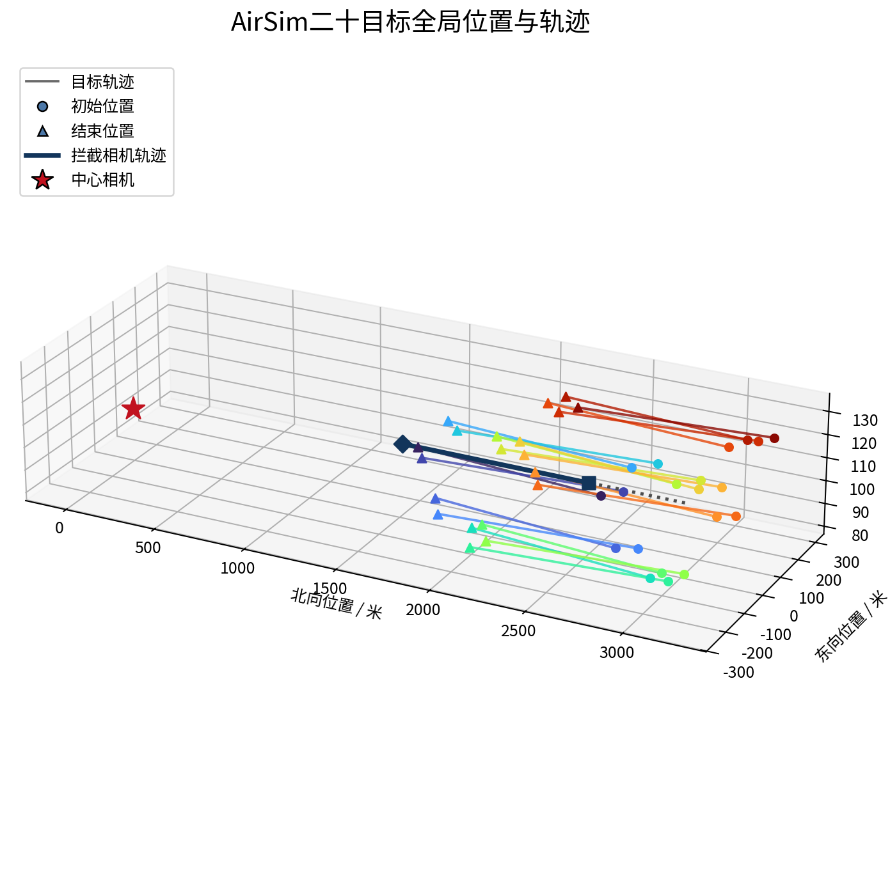

局部放大图去掉中心与目标群之间的大段空域，显示20条目标轨迹的前后错列、高度分层和
横向交叉趋势。结束位置旁的T001至T020用于离线解释，不进入在线配准输入。

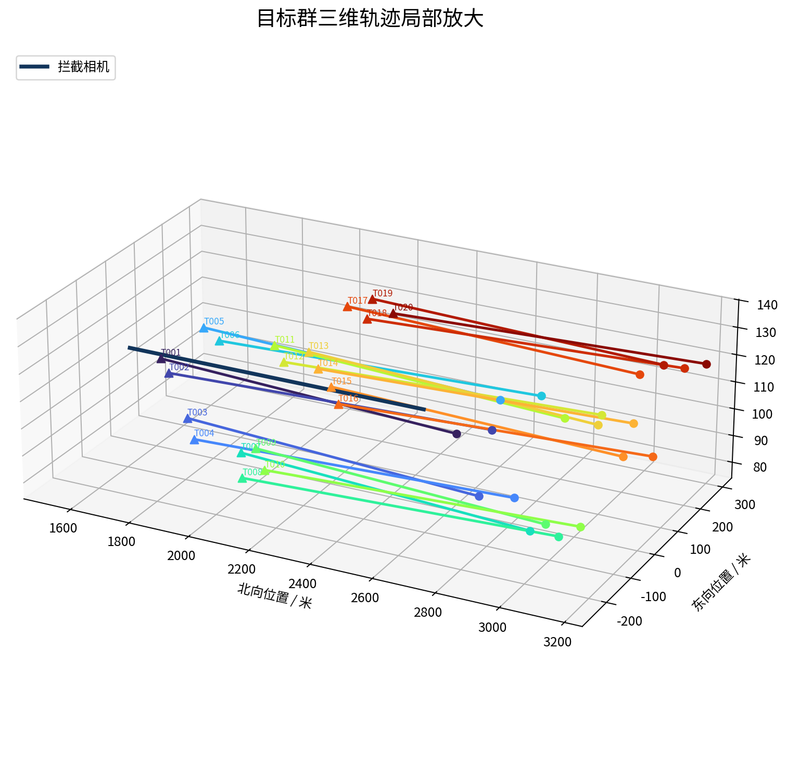

四时刻图分别给出0、6.7、13.3和20秒的位置。目标整体向中心方向推进约1000米，横向速度
正负交替，使部分像面轨迹逐步接近或交叉；实体之间仍保持不小于33.82米的三维间距。

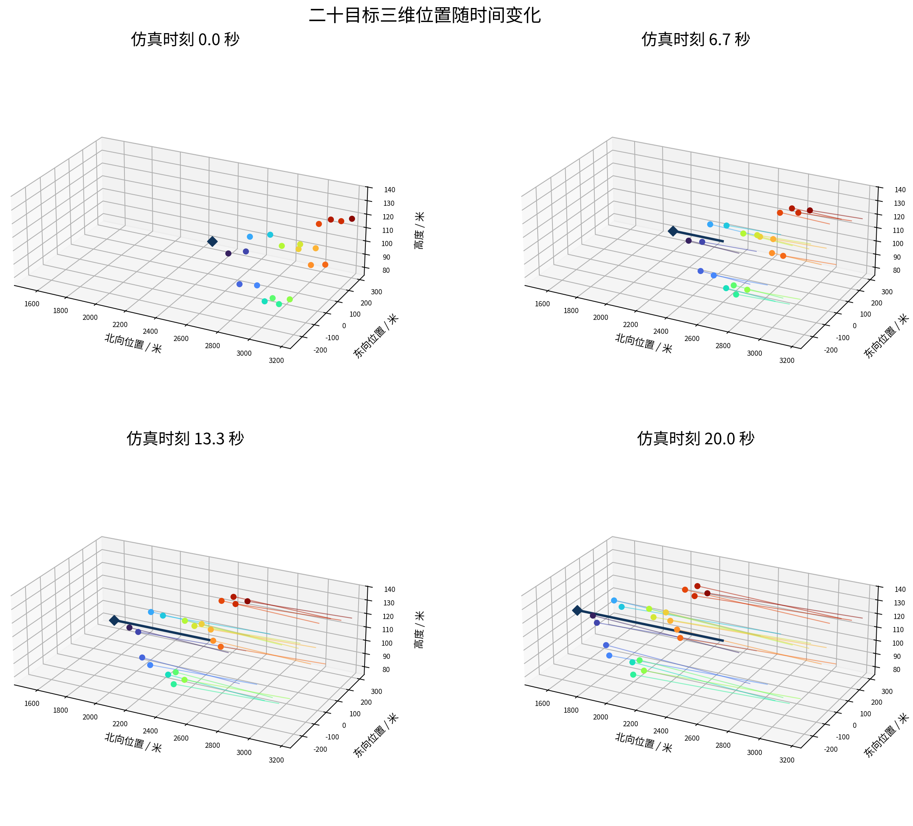

配准事件图将在线`associations.csv`中的已选关联记录按帧号回填到离线Actor轨迹。中心相机
形成197个去重后的关联时刻，拦截相机形成1737个。该图用于说明配准证据出现在哪些空间
区段，不向在线算法提供真实目标位置，也不参与99.79%准确率之外的新评分。

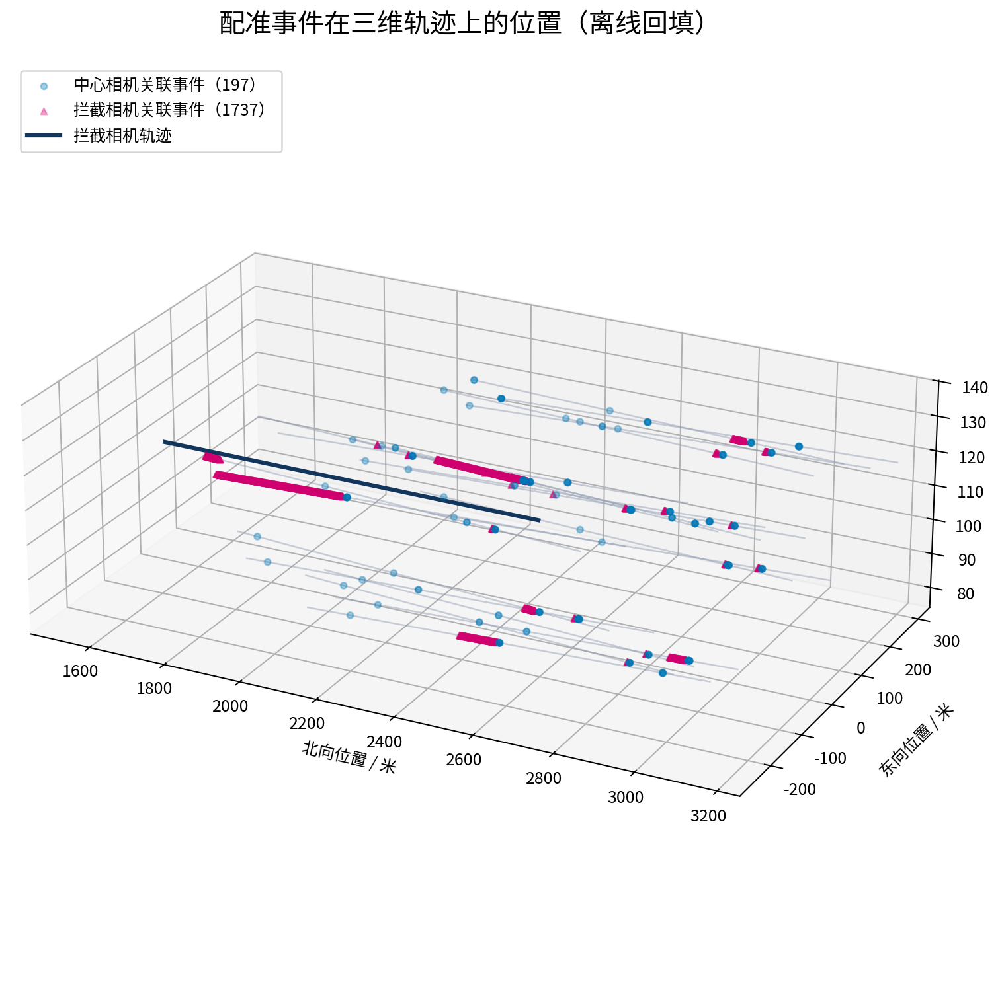

## 配准方法

### 三维投影

目标在北东地坐标系中的位置记为 \(p_N\)，相机位置为 \(c_N\)，量测时刻相机姿态为
\(R_{C\leftarrow N}\)，内参矩阵为 \(K\)。目标在图像中的预测位置由针孔模型给出：

```text
q_C = R(C<-N) [p_N - c_N]
[u, v, 1]^T ~ K q_C
```

投影过程使用量测时间而非消息到达时间。航迹协方差、相机位置姿态误差和像素量测误差应
共同传播到图像平面。本轮 AirSim 主场景使用合成全局航迹和理想相机位姿，尚未注入真实
雷达、惯导和时间同步误差。

### 匿名局部跟踪

AirSim 检测元数据在进入在线 D5 前删除 Actor 名称和对象编号。检测框只保留相机、匿名
本地编号、框中心、宽高、量测时间、到达时间和像素协方差。

早期跟踪器直接在像素平面估计速度。窄视场云台每帧移动时，背景和目标会在图像中产生
较大整体位移，像素跟踪器会把相机运动误判为目标运动。修正版使用同步相机姿态把检测中心
反投影为北东地坐标系中的单位视线，在世界视线上执行恒速预测，再投影回当前图像。检测框
尺度及尺度变化仍保留为辅助代价。

### 几何匹配

每条全局航迹的预测像素与每条匿名局部轨迹形成候选对。像素创新为
\(r_{ij}=u_j-\hat u_i\)，联合协方差为 \(S_{ij}\)，马氏距离为：

```text
d2(i,j) = r(i,j)^T S(i,j)^-1 r(i,j)
```

超过门限的候选先被剔除。保留候选的总代价由像素位置、世界视线运动、检测框尺度和时间
新鲜度组成。匈牙利算法在完整代价矩阵上寻找总代价最小的一对一匹配，防止两个全局航迹
同时占用同一个局部检测。

### 时序保持

新版时序层位于逐帧几何匹配之后。正常观测沿用既有绑定。短时漏检时，根据最近实测像面
角速度预测检测框中心和尺寸，预测协方差随时间增长，默认最多保持 0.25 秒。预测证据只用于
搜索和连续性审计，不能形成末端锁定、提示完成或控制许可。

逐帧匹配提出新的全局航迹时，单帧竞争结果只进入待确认状态。候选需要连续两帧满足几何
门控和代价优势，才允许确认改绑。两条轨迹在交叉处出现成对互换时，系统保持歧义，不让
两条绑定同时交换。超过保持时间仍未获得实测证据时，旧绑定过期，后续观测重新建立绑定。

## 工作过程

### 理想两级配准

第一阶段采用三维质点和解析针孔相机。20 个目标、中心相机 A 和移动相机 B 在全时段保持
可见。A 先完成全局航迹到 A 匿名轨迹的匹配，再把同一三维航迹投影到 B，与 B 匿名轨迹
匹配。算法内部使用两个完整的 20×20 代价矩阵，目标数量由输入决定，没有固定为 20。

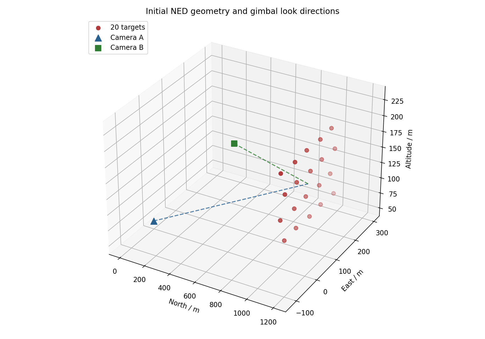

A 侧代价矩阵按全局航迹和匿名局部轨迹排列。对角线附近的低代价结构表示几何预测与实际
像素轨迹一致，匈牙利算法从完整矩阵中选择一对一关系。

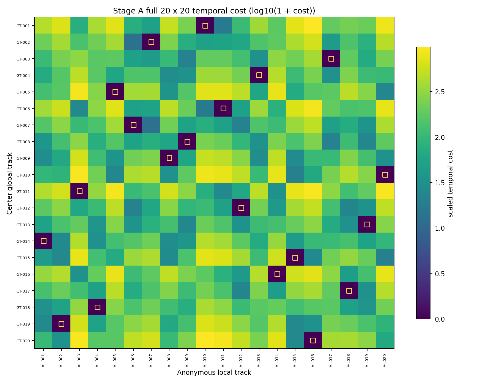

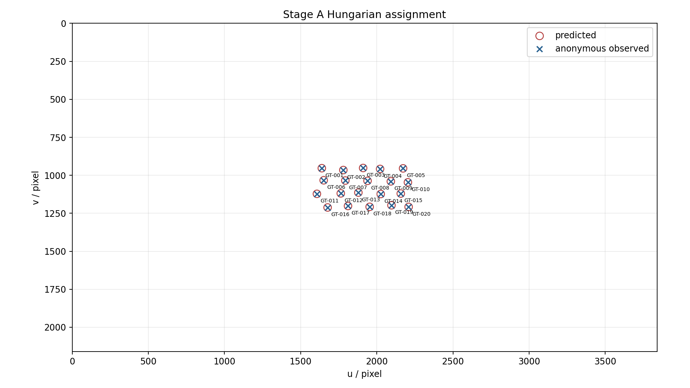

B 侧不继承 A 的本地轨迹编号，只继承中心拥有的三维航迹及其全局编号。系统把这些航迹按
B 的相机位姿重新投影，再与 B 的匿名轨迹重新求解。

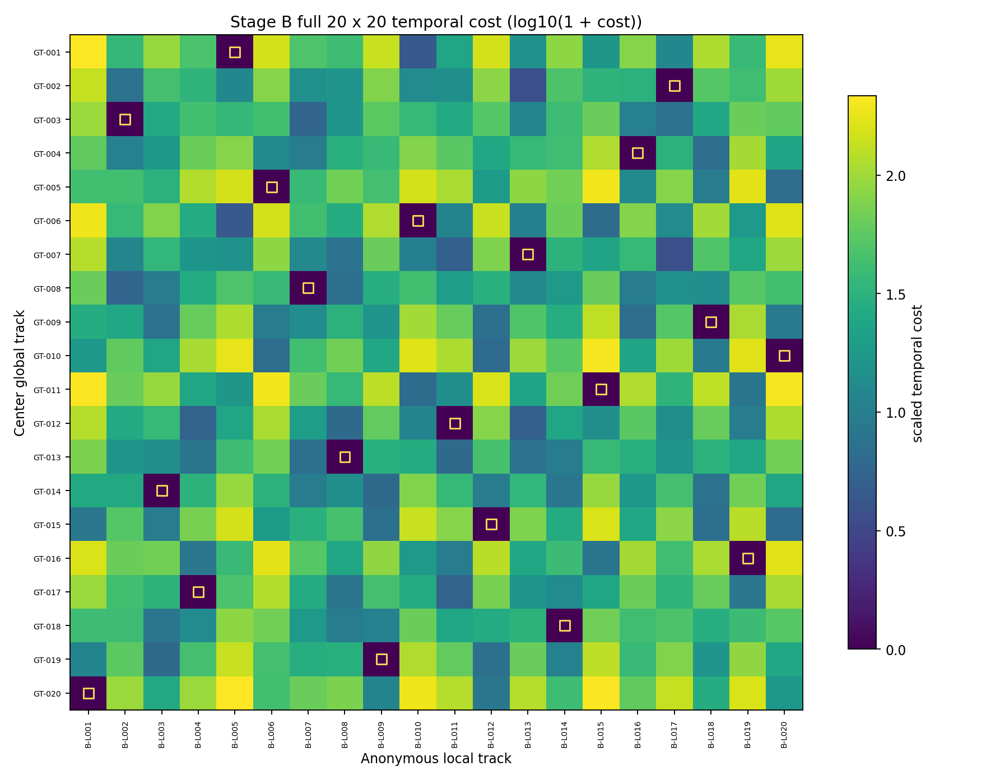

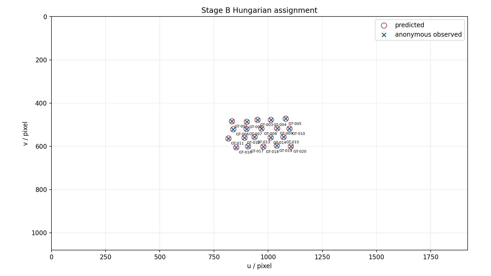

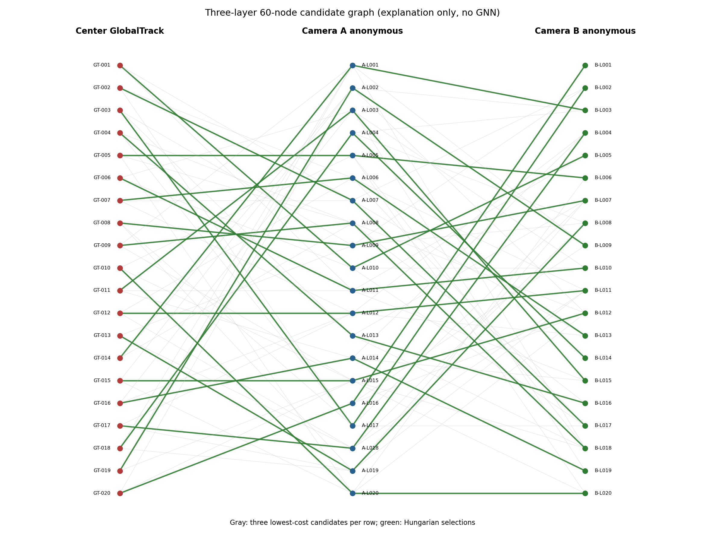

10 个种子全部通过。A、B 和端到端准确率均为 1.0，完整关系链比例为 1.0，身份切换、重复
分配、未匹配、在线真值使用和全局编号改写均为 0。该阶段确认了几何投影、时间窗代价和
两级匈牙利求解的基本关系，尚未检验误差条件。

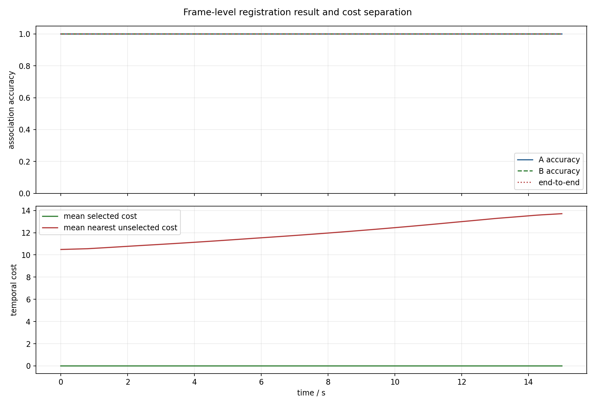

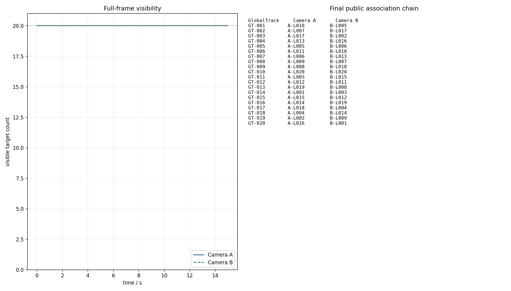

### 不规则交叉与窄视场扫描

第二阶段取消全时段可见假设。20 个目标距中心约 2.8 至 3.2 千米，径向跨度 390 米，高度
跨度 33.6 米，最小三维间距约 30 米。目标在 A、B 像面分别形成 10 对和 6 对交叉或近距交叉。

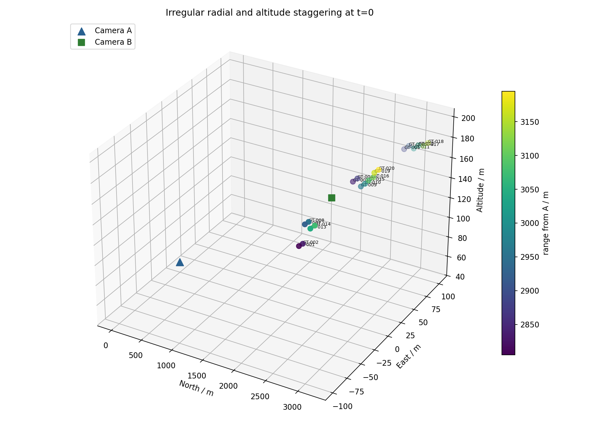

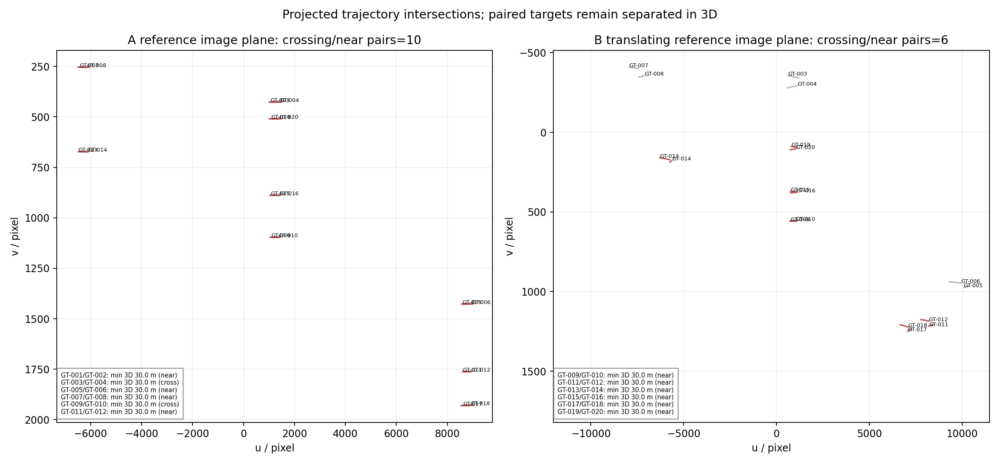

机械模式按 180 度/秒扫描。100 赫兹下相邻光轴间隔为 1.8 度，大于中心相机 0.621 度水平
视场，目标落入离散采样间隙，中心发现率为 0。安全覆盖模式把相邻光轴间隔限制为视场的
80%，对应 49.68 度/秒，并在相邻视场间保留 20% 重叠。安全覆盖模式 1.61 秒完成全部目标
发现和两级配准，10 个种子全部通过。

这一阶段得到的工程结论是：云台“2 秒转一圈”只描述机械能力，不能直接转换为有效搜索
能力。扫描角速度必须同时受相机视场、实际采样频率、帧间重叠和确认驻留时间约束。

机械扫描时间线显示光轴从目标之间越过，没有形成连续五帧确认。安全覆盖时间线中，相邻
视场保持重叠，20个目标依次进入确认状态。

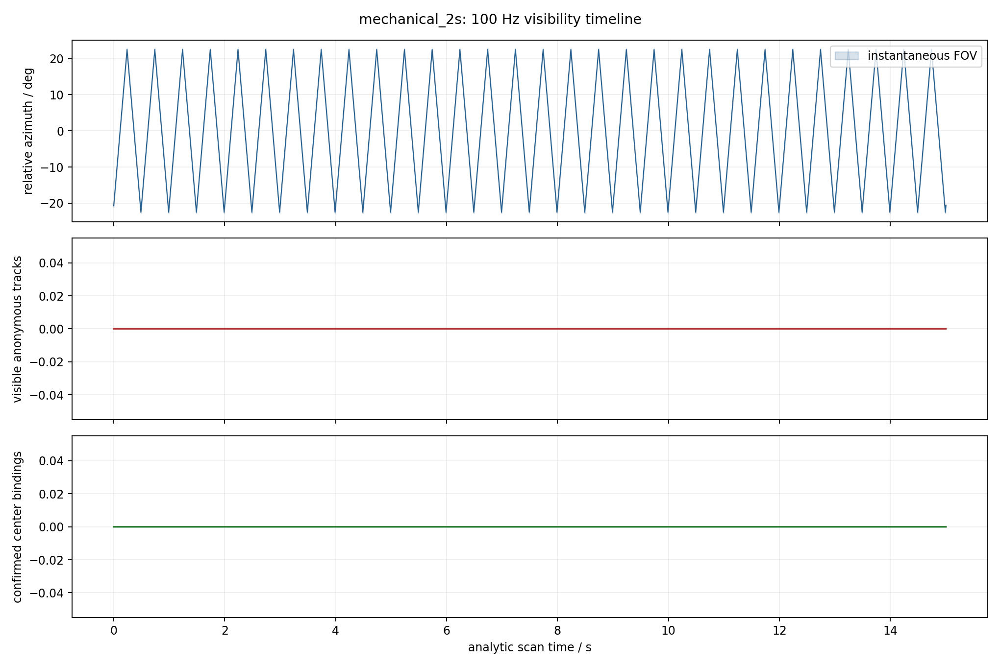

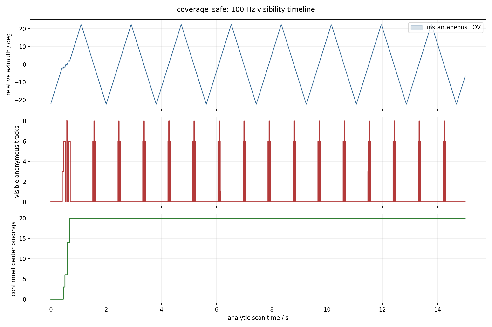

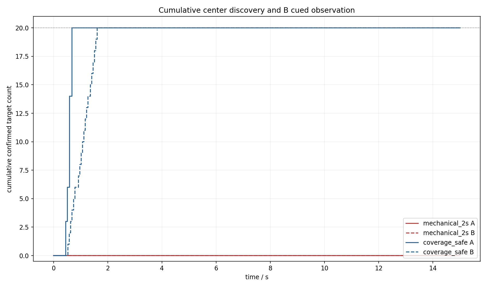

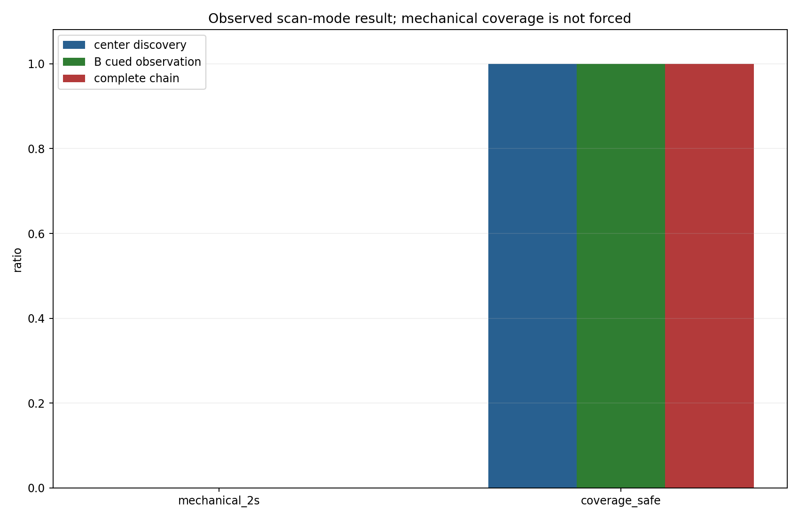

### AirSim初次长距离试验

第三阶段把相机、Actor 和 `simGetDetections` 接入真实 Blocks。初次场景目标速度为 3.5 至
4.7 米/秒，观察窗口较短，中心只执行偏航扫描。安全覆盖模式累计发现 8/20，连续确认
8/20，拦截相机只观察到 5/8；机械模式发现 4/20。

中心相机垂直视场约 0.516 度，目标俯仰范围约为 -0.408 至 0.761 度。单轴扫描遗漏了多个
高度层，3 秒提示窗口也不足以顺序处理已确认目标。该问题随后通过偏航、俯仰二维蛇形扫描
和延长观察时间处理。

### 高速二维扫描

第四阶段把目标速度提高到 50 米/秒，观察时间延长到 12 秒。中心根据全局航迹和协方差
生成 8 行、736 个栅格点的二维扫描计划。安全覆盖模式发现 20/20、确认 19/20，19 条拦截
提示全部完成，关联准确率为 99.22%。

二维扫描解决了目标发现覆盖，却暴露出局部跟踪问题：旧像素跟踪器记录 55 次身份切换、
68 次轨迹中断，交叉窗口内有 23 次身份切换。主要原因是云台运动被误认为目标运动，长期
离开视场后的重新发现也被混入连续身份切换统计。

### 世界视线运动补偿

第五阶段先对同一历史日志进行离线复核，再用修正版重新运行真实 Blocks。评分口径拆分为
连续可见、短缺口和长期重发现：不超过 0.05 秒为连续观测，0.05 至 0.50 秒为短缺口，超过
0.50 秒为长期重发现。交叉窗口只有在指定目标对同时出现且时间样本充分时才参与评分。

离线复核中，安全覆盖模式在新口径下的连续段身份切换由 36 降为 0，机械模式由 16 降为
0。真实复跑也得到连续段身份切换 0。安全覆盖模式发现 20/20、确认 17/20，17 条提示全部
完成，1115 条可评分关联的准确率为 99.82%；几何绑定切换由旧高速场景的 41 次降至 4 次。

二维扫描栅格给出中心相机在45度扇区中的偏航、俯仰搜索路径。累计发现曲线用于核对扫描
过程中发现数是否持续增加，而不是只报告结束时总数。

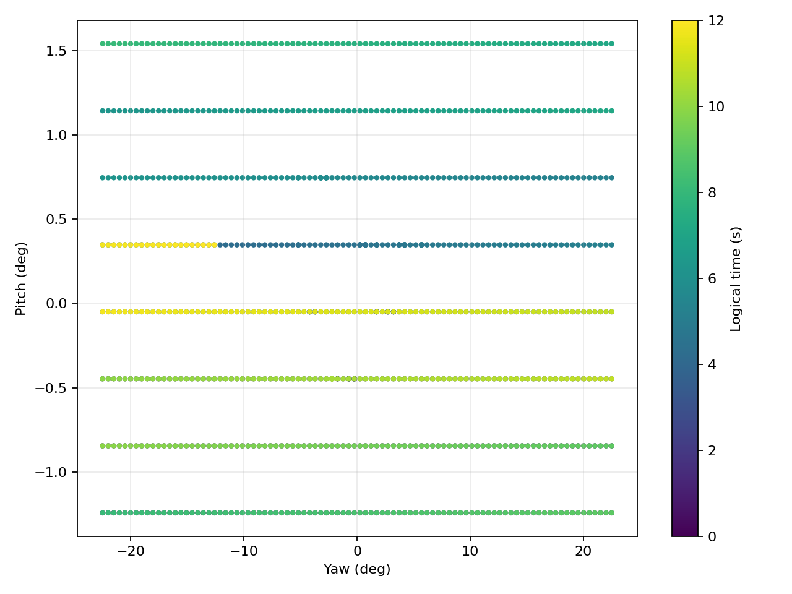

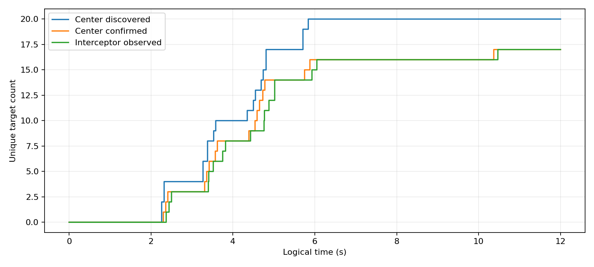

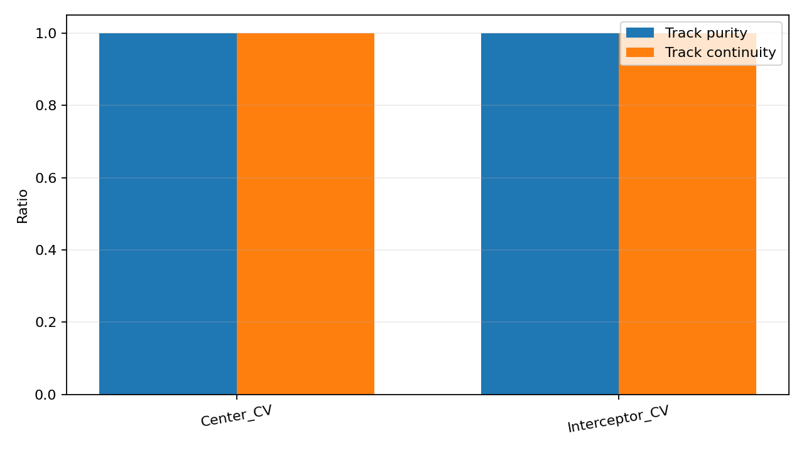

该阶段仍有 3 次短缺口。18 个交叉窗口中只有 2 个可评分，不能据此证明全部交叉场景已经
稳定。中心确认数从 19 降为 17，说明一次单种子结果不能用于单独调整阈值，需要延长窗口和
多种子统计。

### 二十秒视觉取证

第六阶段把观察时间延长到 20 秒，并同时保存定时截图和关联事件截图。中心发现和确认
20/20，拦截相机完成 19/20 个提示。主场景保存 98 幅相机原图和 98 幅标注图，形成 19 组
可以人工核对的双相机同一全局航迹证据。

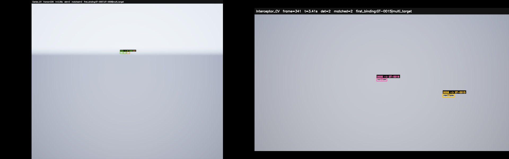

中心相机原图中的三千米目标较小。标注图叠加了匿名检测框、中心航迹预测点和两者之间的
像素偏差。拦截相机距离约500米，目标轮廓更清楚，可在同一帧内核对多个局部轨迹。

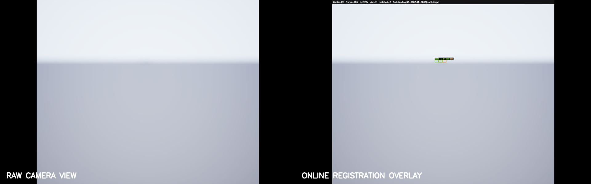

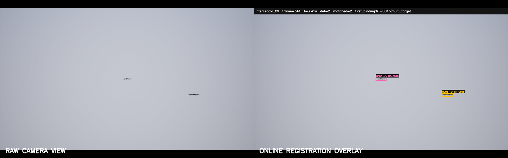

以下五组图片覆盖主场景形成双相机证据的19条全局航迹。每一行左侧来自中心相机，右侧来自
拦截相机。两侧本地编号可以不同，中间的全局航迹编号保持一致。

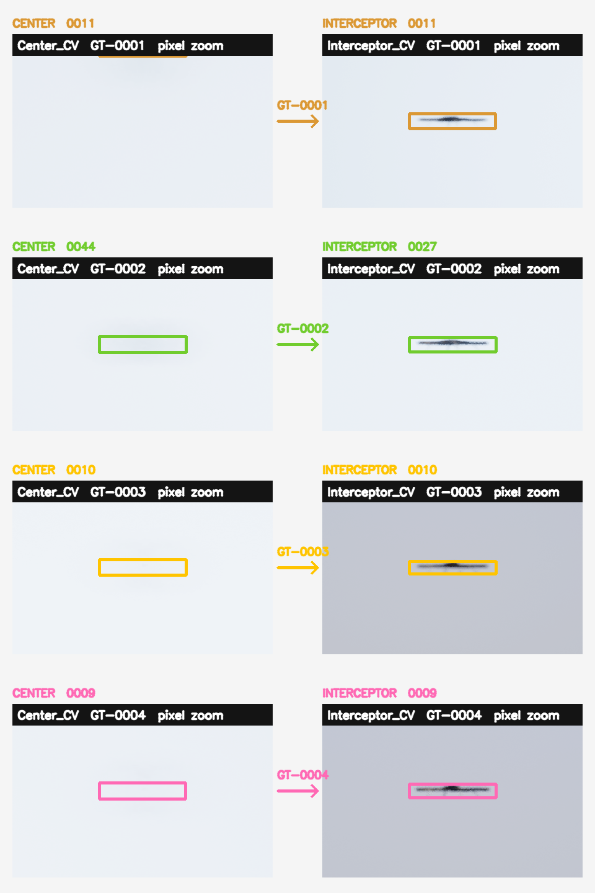

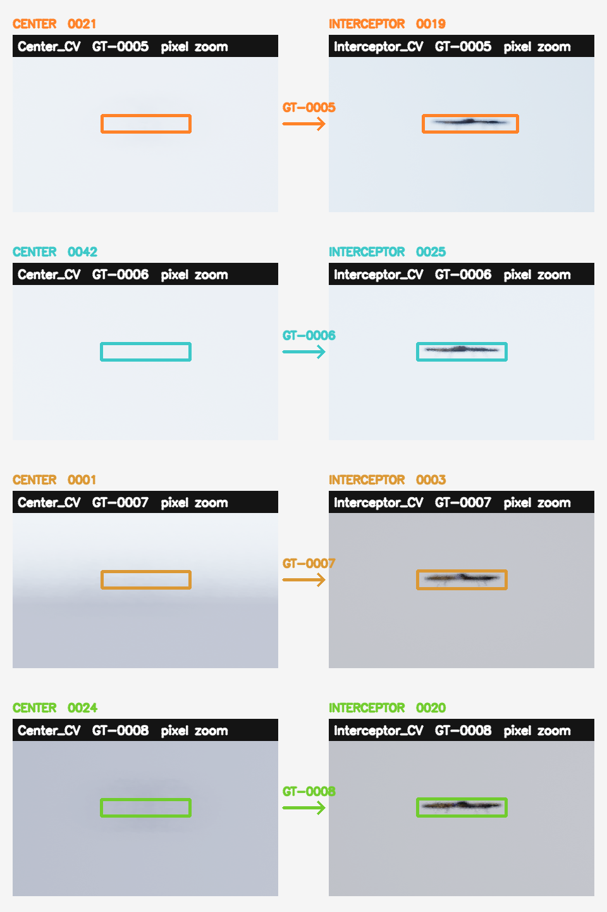

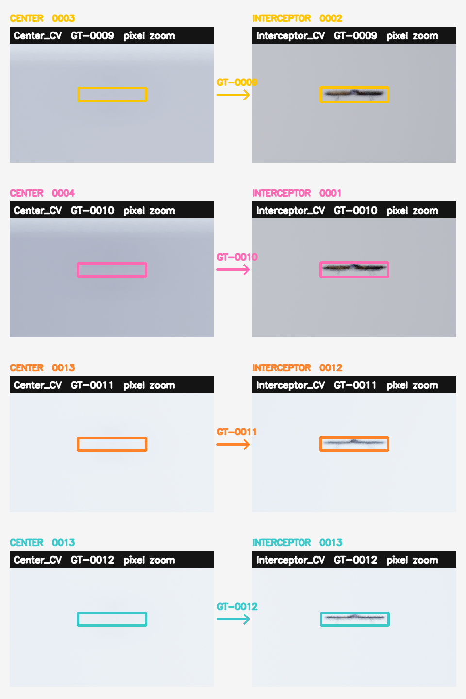

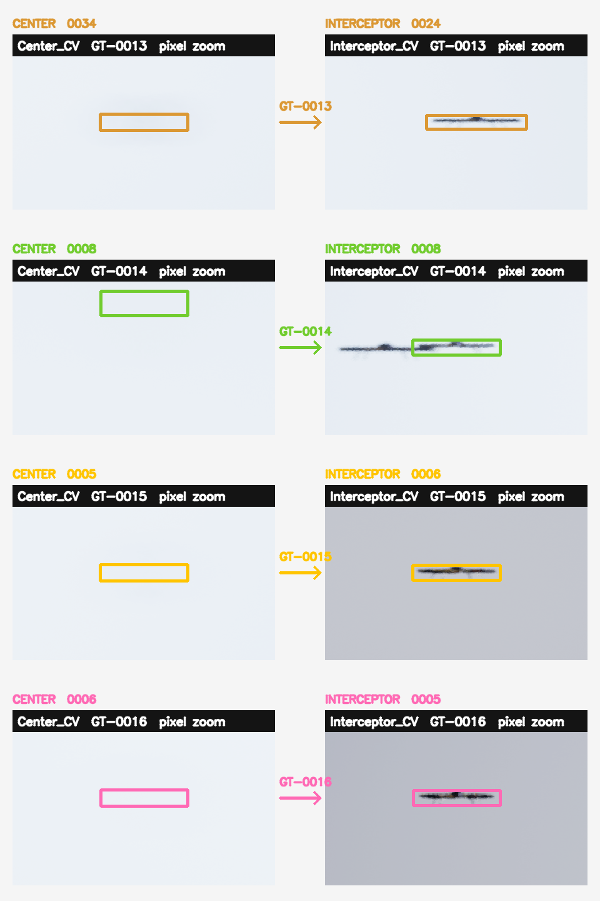

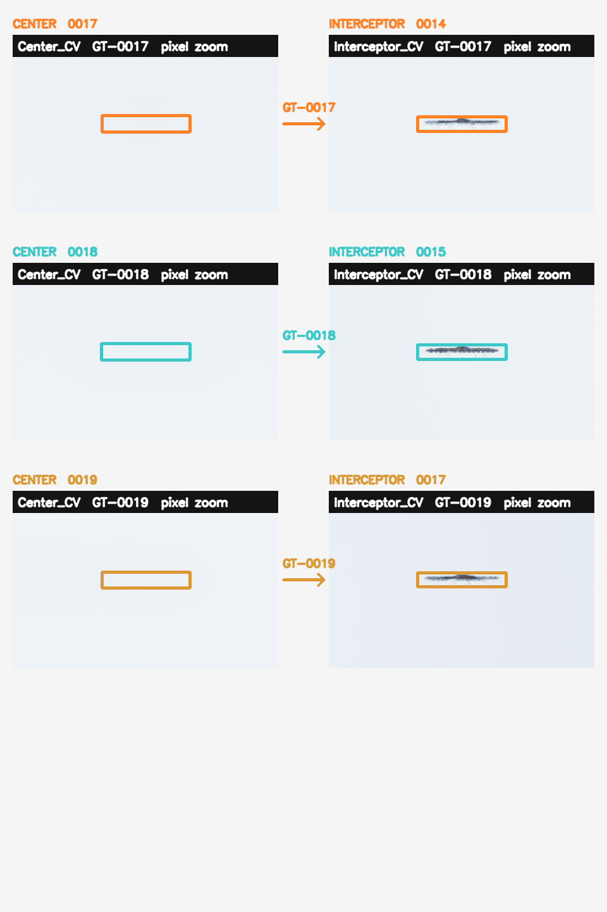

1934 条可评分关联中 1930 条正确，准确率为 99.79%。连续可见段身份切换为 0，短缺口为
3，长期重发现为 48，几何绑定切换为 7。较多长期重发现主要来自中心窄视场周期扫描离开
目标，不应与连续可见阶段的身份切换合并。

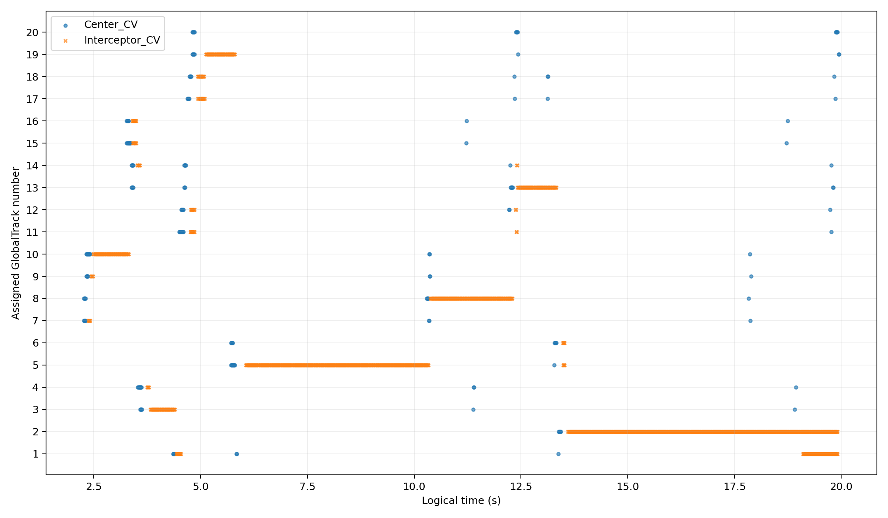

31 个交叉窗口只有 3 个可评分。已评分窗口中没有身份切换，但评分覆盖率只有 9.68%。当前
结果可以说明“已形成的匹配大多正确”，不能说明“全过程所有目标持续稳定配准”。

混淆矩阵接近对角线，反映1934条可评分记录中的大部分匹配正确。投影误差分布描述全局航迹
预测点与检测框中心之间的偏差。两图都只使用离线真值评分，不向在线算法提供真实编号。

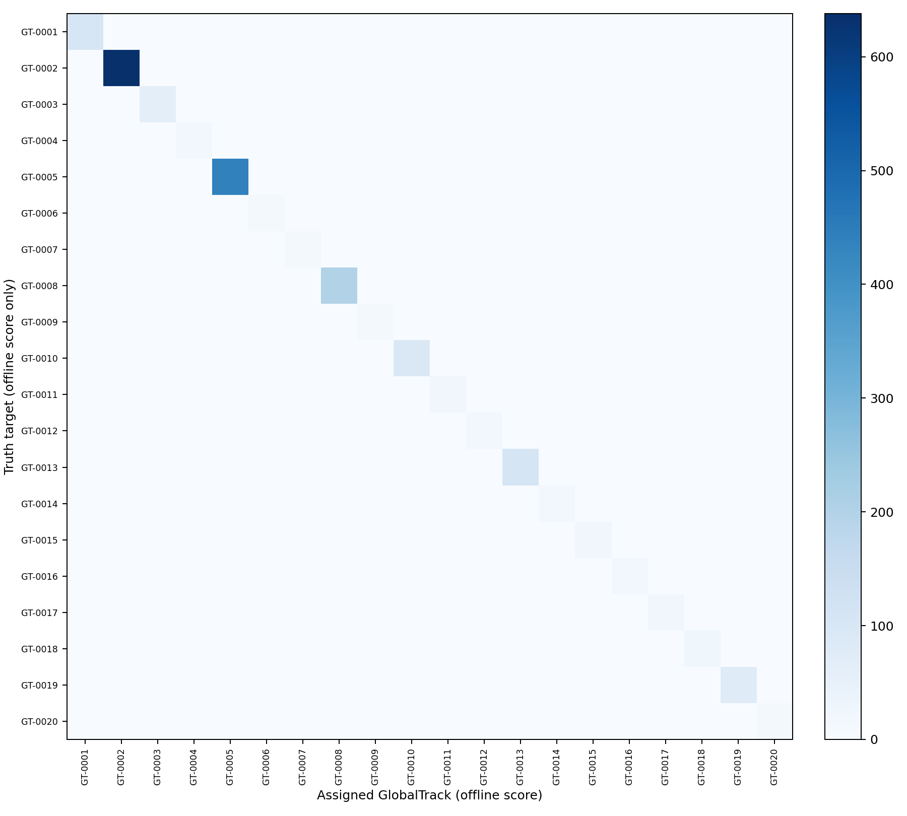

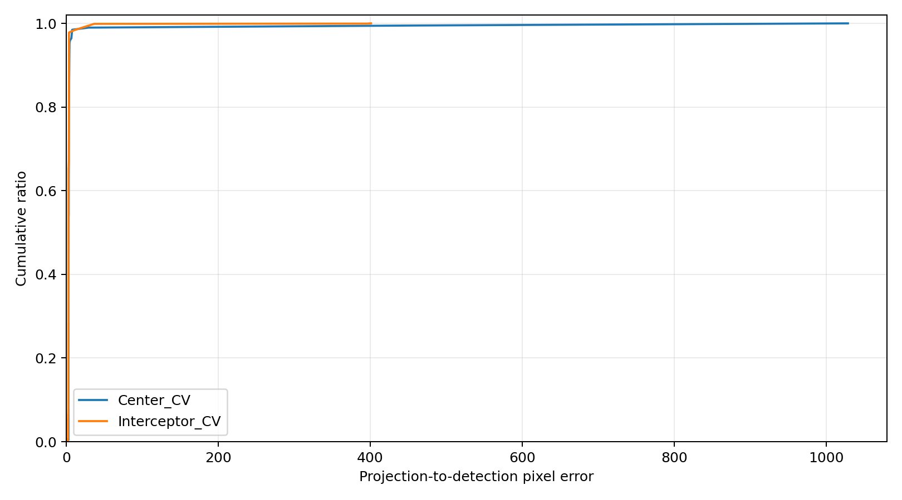

### 目标尺寸诊断

为排查三千米目标过小问题，另运行目标网格放大 2 倍的诊断组。该组中心确认 20/20，拦截
提示完成 20/20，双相机证据由 19/20 提高到 20/20。可评分记录增加到 2319 条，但准确率
下降到 98.92%，几何绑定切换从 7 次增加到 42 次，长期重发现从 48 次增加到 56 次。

目标框放大改善了截图可见性，同时增加相邻框重叠和局部轨迹竞争。扩大网格不是解决密集
目标配准的有效方法，该组只保留为视觉诊断，不替代原始尺度主场景。

### 时序关联修复

第七阶段冻结主场景旧版证据，并实现 D5 时序连续性修复。冻结数据只保留 35 个关键帧和
70 条双相机在线记录，真实编号单独放入离线侧车。新版支持有界外推、同编号恢复、绑定
过期、两帧换绑确认和交叉歧义保持。每台相机、每个 episode 使用独立状态，reset 后不继承
上一轮绑定。

main 新增 `temporal_binding_events.csv` 和 `dropout_events.csv`，并规定只有实测绑定可以
进入发现、提示、完成、准确率和视觉控制证据。D6 新增逐 episode、聚合、中文报告和指标图，
缺少字段时标为不可用，不补零。


冻结旧基线仍为失败关闭：短缺口 3 次，绑定振荡事件在旧版记录中不可用，交叉可评分比例
为 3/31。D5 时序专项 13 项、D5 全量 904 项、AirSim 长距专项 23 项、D6 专项 7 项和 D6
全量 1425 项通过。以上是代码和接口验证，不是新版真实 AirSim 性能结果。

## 阶段结果

| 阶段 | 场景 | 关键结果 | 判定 |
|---|---|---|---|
| 理想两级配准 | 20目标，10种子，全时可见 | A/B/端到端准确率100%，身份切换0 | 理想几何通过 |
| 理想窄视场机械扫描 | 20目标，180度/秒 | 发现0/20，完整链0 | 证明存在采样漏区 |
| 理想安全覆盖扫描 | 20目标，49.68度/秒 | 10/10种子发现和完整链100% | 解析扫描通过 |
| AirSim初次单轴扫描 | 3.5至4.7米/秒 | 安全覆盖发现8/20，机械扫描4/20 | 未通过 |
| AirSim高速二维扫描 | 50米/秒，12秒 | 发现20/20，确认19/20，准确率99.22%，IDSW 55 | 覆盖通过，跟踪未通过 |
| 世界视线修正版 | 50米/秒，12秒 | 发现20/20，确认17/20，准确率99.82%，连续IDSW 0，短缺口3 | 连续段改善，总门未通过 |
| 20秒原始尺度取证 | 50米/秒，20秒 | 确认20/20，提示完成19/20，准确率99.79%，短缺口3，绑定切换7，交叉3/31 | 冻结主基线，失败关闭 |
| 2倍网格诊断 | 50米/秒，20秒 | 提示完成20/20，准确率98.92%，绑定切换42 | 仅诊断，不晋级 |
| 新版时序修复 | 冻结回放与接口测试 | 有界保持、换绑迟滞、交叉保持和D6接线完成 | 代码通过，真实复跑待做 |

不同阶段的身份切换和轨迹中断不能直接按同一列计算降幅。早期口径把长期重发现混入连续
身份切换，修正口径把连续段、短缺口和长期重发现分别统计。可以直接比较的是同一历史日志
在新口径下的离线复核，以及世界视线修正版的真实复跑结果。

## 问题台账

| 问题 | 处理措施 | 当前状态 | 证据 |
|---|---|---|---|
| 理想条件下两级关系是否可解 | 三维投影、时间窗代价、两级匈牙利匹配 | 已验证 | 10/10种子完整链100% |
| 高速机械扫描存在帧间漏区 | 按视场和采样周期限制角速度，保留20%重叠 | 理想场景已验证 | 机械0/20，安全覆盖20/20 |
| 单轴扫描遗漏不同高度目标 | 增加偏航/俯仰二维蛇形扫描 | AirSim接口已验证 | 发现由8/20提高到20/20 |
| 提示窗口不足 | 观察窗口由约3秒扩展到12秒和20秒 | 已改善 | 20秒主场景提示完成19/20 |
| 像素跟踪误把云台运动当目标运动 | 检测反投影到北东地世界视线，执行相机运动补偿 | 已实现并实跑 | 连续段IDSW降到0 |
| 长期重发现被误计为连续换号 | 采用连续、短缺口、长期重发现三段口径 | 已修正 | 主基线分别为0、3、48 |
| 交叉窗口无共同观测仍被统计 | 按相机、指定目标对和共同帧判定可评分性 | 已修正 | 3/31可评分，28个明确不可评分 |
| 三千米目标截图不清楚 | 增加事件截图、原图/标注图对照和2倍网格诊断 | 取证已完成 | 主场景19组双相机证据 |
| 放大目标是否能解决配准 | 运行2倍网格对照 | 已否定 | 准确率下降，绑定切换升至42 |
| 短时漏检造成轨迹中断 | 0.25秒有界外推、协方差增长、同编号恢复 | 代码完成，实跑待验 | 旧基线短缺口仍为3 |
| 单帧竞争导致错误换绑 | 连续两帧确认、交叉成对互换保持 | 代码完成，实跑待验 | 旧基线绑定切换仍为7 |
| 预测证据可能越权进入控制 | 预测记录固定禁止末端授权 | 已完成回归 | 专项测试通过，实跑需继续核对0越权 |
| 在线使用AirSim真实身份 | 在线/离线侧车隔离，D6只离线评分 | 已关闭 | 在线真值、重复分配、全局编号改写均为0 |
| 交叉样本覆盖不足 | 新增`crossing_calibration_v1`几何预检 | 仍开放 | 预检通过，真实成像尚未复跑 |
| 真实探测器能力未知 | 当前仅使用`simGetDetections`元数据 | 仍开放 | 不具备真实识别率证据 |
| 雷达、姿态和时钟误差未进入 | 计划注入航迹、外参、时间、漏检和虚警误差 | 仍开放 | 当前主场景为合成航迹和理想位姿 |
| 单种子结果代表性不足 | 计划先单种子冒烟，再运行不少于10个未见种子 | 仍开放 | 真实主基线只有seed 20260810 |
| 运行速度不足实时 | 保留RPC和墙钟统计 | 仍开放 | 12秒场景实时因子约0.23至0.25 |

## 结果解释

### 高准确率不等于全过程稳定

99.79%的分母是已经形成且能够离线评分的1934条配准记录。没有进入视场、没有检测到、没有
通过门控或交叉时样本不足的目标不在该准确率分母中。发现覆盖、提示完成、连续性、交叉
可评分率和配准准确率必须同时报告。

### 长期重发现不等于连续身份切换

中心相机水平视场只有0.621度，需要周期扫描45度扇区。相机离开目标后，目标数秒后重新进入
视场属于重新发现。该现象影响关系链恢复速度，但不能直接记为连续可见期间的身份跳变。
短缺口只有3次，却会直接打断当前末端绑定，因此仍保持严格门控。

### 检测元数据不等于真实识别能力

中心相机在三千米距离的原图中，部分目标接近 AirSim 渲染和显示极限；`simGetDetections`
仍可返回检测框。当前试验验证的是相机几何、匿名跟踪、跨视角交接和软件接口，不是实际
可见光或红外设备对三千米无人机的识别概率。

### 图神经网络尚未进入本次主线

理想和 AirSim 主场景均采用几何门控与匈牙利匹配。候选关系图用于解释候选边，没有执行
图神经网络推理。当前主要失败来自共同可见不足、短时漏检和扫描离视场，先补足观测证据比
直接更换匹配求解器更有效。图神经网络适合作为后续误差、遮挡和密集交叉数据上的对照，
不能替代相机标定、时间同步和基本可观测性。

## 当前能力

当前系统能够在理想相机位姿和合成全局航迹条件下，完成以下工作：

1. 根据三维航迹和协方差生成中心相机二维扫描范围。
2. 控制中心和拦截相机的偏航、俯仰指向。
3. 将20个运动目标作为匿名检测和局部轨迹处理。
4. 使用相机内外参把中心航迹投影到不同相机图像。
5. 使用几何门控和匈牙利算法形成一对一局部轨迹到全局航迹绑定。
6. 保持全局航迹编号由中心拥有，隔离AirSim真实身份。
7. 区分连续身份切换、短缺口和长期重发现。
8. 输出逐帧检测、关联、云台、交叉窗口、提示、离线真值和D6评估记录。

当前不能据此宣称：真实雷达误差下仍能稳定投影；真实光电设备能在三千米稳定识别目标；
密集交叉场景已经充分验证；新版时序修复已经降低真实 AirSim 的短缺口和绑定切换；系统已
满足实时运行；结果可以外推到实飞。

## 后续验收

第一步运行新版 `crossing_calibration_v1` 单种子真实 AirSim 冒烟。必须确认两个新增事件
文件实际产生、episode reset 后状态为空、D6 自动报告完整、预测记录的末端授权数为 0。

第二步与冻结基线按相同口径比较：短缺口由旧版 3 次降至 0；确认绑定切换低于旧版 7 次；
连续可见身份切换、重复分配、在线真值使用和全局编号改写均保持 0；可评分交叉窗口不少于
10 个且比例不低于 30%。单种子未达到记录完整性要求时，不启动正式批量试验。

第三步运行不少于 10 个未见种子。逐种子保留发现率、确认率、提示完成率、关联准确率、
短缺口、长期重发现、绑定切换、交叉可评分率和失败原因。D6输出逐种子数据、聚合结果、
置信区间和中文报告。

第四步分档注入真实工程误差，包括中心航迹位置和速度误差、相机位置姿态误差、量测与到达
时间偏差、检测漏报、虚警、遮挡和通信延迟。各误差档分别标定投影协方差、马氏门限、保持
时间和换绑确认窗口，不使用单一放宽门限覆盖所有条件。

第五步接入真实无人机检测数据。`simGetDetections`继续作为几何接口基线，真实检测器作为
独立输入进行同场景对照。检测召回率、误报率、检测框抖动和推理延迟单独报告，避免把检测
失败归因于配准算法。

## 证据索引

- 理想两级报告：`research_modules/d5_terminal_association/outputs/ideal_20_target_two_stage_registration_20260810/`
- 不规则交叉报告：`research_modules/d5_terminal_association/outputs/ideal_20_target_irregular_crossing_20260810/`
- AirSim初次长距基线：`research_modules/airsim_runtime/outputs/d5_cv_long_range_20target_20260810/`
- AirSim高速二维扫描：`research_modules/airsim_runtime/outputs/d5_cv_long_range_20target_50mps_2d_20260810/`
- 历史日志离线复核：`research_modules/airsim_runtime/outputs/d5_cv_long_range_20target_50mps_2d_20260810_mot_reaudit/`
- 世界视线修正版实跑：`research_modules/airsim_runtime/outputs/d5_cv_long_range_20target_50mps_2d_worldray_v2_20260810/`
- 原始尺度视觉取证：`research_modules/airsim_runtime/outputs/d5_cv_long_range_20target_visual_evidence_20260810/`
- 三维轨迹统计：`subagent_reviews/assets/d5_20_target_long_range_20260810/airsim_3d_trajectory_summary.json`
- 2倍网格诊断：`research_modules/airsim_runtime/outputs/d5_cv_long_range_20target_scale2_visual_diagnostic_20260810/`
- 冻结基线与D6评估：`research_modules/airsim_runtime/baselines/d5_long_range_20target_20260810/`
- 时序修复集成报告：`subagent_reviews/MAIN_D5_LONG_RANGE_TEMPORAL_INTEGRATION_REPORT_20260810.md`

本报告统计截止日期为2026年8月10日。AirSim结果均为仿真证据，不属于实飞或设备定型结果。
